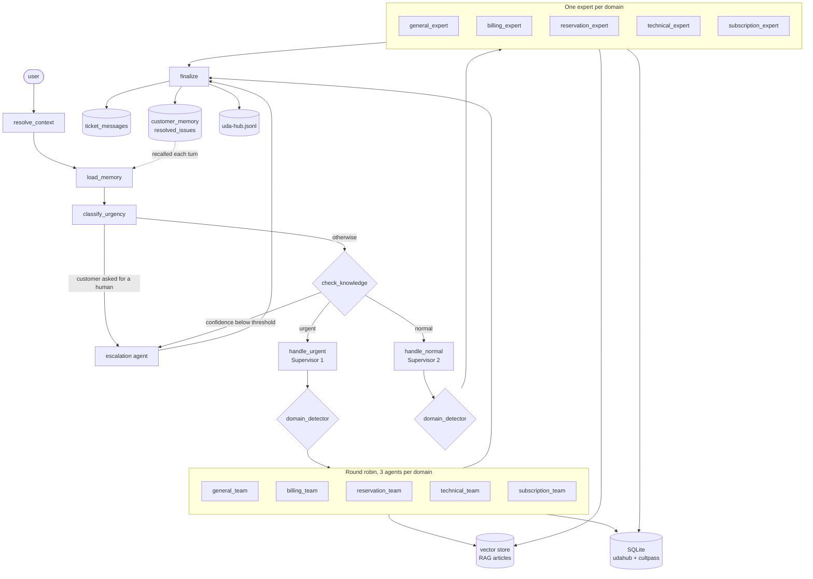

# UDA-Hub architecture

A ticket is classified by urgency, checked against what we actually know, then
routed. Urgent work goes to a team of interchangeable agents picked
round-robin, normal work to a single domain expert, and anything a person needs
to handle goes to the escalation agent.

## Agents and their roles

| Agent | Responsibility |
| --- | --- |
| `classify_urgency` | Decides urgent / normal / escalation from the message **and** the ticket's metadata. Does not answer anything. |
| `check_knowledge` | Scores whether the knowledge base or the customer's own records can support an answer at all. |
| `handle_urgent` (Supervisor 1) | Detects the domain and dispatches to that team's next agent. Delegates only. |
| `handle_normal` (Supervisor 2) | Detects the domain and hands off to that single expert. Delegates only. |
| Domain experts and team agents | Answer the question using the knowledge base and customer data tools. |
| `escalation_agent` | Marks the ticket escalated and tells the customer a person will follow up. |
| `finalize` | Records the outcome on the ticket, in long-term memory, and in the log. |

This is the **supervisor pattern**, twice: one supervisor for each priority
lane, each fronting a pool of specialists.

## Routing

`classify_urgency` applies its rules in order and stops at the first match, so
escalation outranks urgency. "This is broken, get me a manager" is an
escalation, because no automated answer will satisfy it.

It classifies on more than the message text. The ticket's `channel`, `tags`,
`status` and age are loaded by `resolve_context` and passed to the classifier,
so a ticket already tagged `login, access` on a chat channel reads as more
urgent than the same words typed cold.

Both supervisors then call `domain_detector` and dispatch. Neither answers a
ticket itself.

## Two ways into escalation

1. **The customer asked.** Detected at classification, and it skips the
   knowledge check — there is no point scoring articles for someone who has
   already said they want a person.
2. **We have nothing to answer with.** `check_knowledge` retrieves the top
   articles and scores coverage from 0 to 1. Below
   `KNOWLEDGE_CONFIDENCE_THRESHOLD` the ticket goes to a human rather than to
   an agent that would have to invent something.

The second check distinguishes *no article* from *no answer*. A question about
the customer's own bookings has no article behind it but is still answerable
from their records, so the scorer returns `answerable_by="customer_data"` and
the ticket proceeds. Only questions outside both fall through to a person.

## Round robin

Each domain has three interchangeable agents. `handle_urgent` reads the
rotation counter for that team, runs the team graph, and writes the next
position back. The counter lives in the orchestrator's state as `rr_index`
rather than inside the team graph, so it survives from one ticket to the next
instead of resetting to the first agent every time.

## Memory

Three levels, doing different jobs:

| Level | Where | Scope |
| --- | --- | --- |
| Short term | `SqliteSaver` checkpointer, keyed by `thread_id` | One conversation, across turns and across restarts |
| Conversation record | `ticket_messages` | One ticket, permanently |
| Long term | `customer_memory`, `resolved_issues` | One customer, across every session |

`load_memory` reads the long-term tables at the start of every turn and injects
both preferences and previously resolved issues into each agent's context.
Experts write preferences with `remember_customer_preference`; `finalize`
records how the ticket ended.

The checkpointer is on disk deliberately. `MemorySaver` would lose every thread
when the process exits, which makes "retrieve previous interactions for
returning customers" impossible to honour.

## Logging

Every decision is one JSON object per line in `data/logs/uda-hub.jsonl`:
`ticket_received`, `memory_recalled`, `classified`, `knowledge_checked`,
`routed`, `tool_used`, `resolved`. Each carries `ticket_id` and `customer_id`,
so `read_log(ticket_id=...)` replays a whole ticket, and
`read_log(event="routed")` shows every routing decision the system has made.

Tool usage is logged from the agent's returned messages rather than from inside
each tool, which keeps the tools free of logging code while still capturing
every call.

## Tools

Experts get the knowledge base, customer and ticket lookups, and the memory
tools. They deliberately do **not** get `escalate_ticket` — only the escalation
agent can hand a ticket to a human, so an expert cannot escalate its way out of
a hard question.
