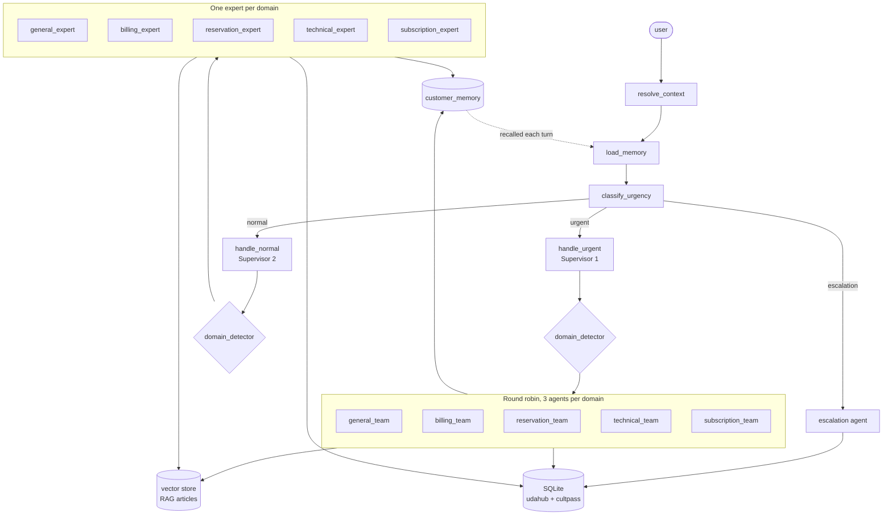

# UDA-Hub architecture

A ticket is classified by urgency first, then routed to one of three paths:
urgent work goes to a team of interchangeable agents picked round-robin,
normal work goes to a single domain expert, and anything needing a person goes
to the escalation agent.

## Routing

`classify_urgency` applies its rules in order and stops at the first match, so
escalation outranks urgency. "This is broken, get me a manager" is an
escalation, not an urgent ticket, because an automated answer cannot satisfy
it.

Both supervisors then call `domain_detector` and dispatch. They do not answer
tickets themselves.

## Round robin

Each domain has three interchangeable agents. `handle_urgent` reads the
rotation counter for that team, runs the team graph, and writes the next
position back. The counter lives in the orchestrator's state as `rr_index`
rather than inside the team graph, so it survives from one ticket to the next
instead of resetting to the first agent every time.

## Memory

Two levels, doing different jobs:

- **Short term** is the checkpointer on the orchestrator. It keeps `messages`
  and `rr_index` alive for one `thread_id`, which is what lets a follow-up turn
  know what was already said.
- **Long term** is the `customer_memory` table. `load_memory` recalls it at the
  start of every turn and injects it into each agent's context; experts write
  to it with `remember_customer_preference`. It outlives the session, so a
  preference stated last week still applies today.

## Tools

Experts get the knowledge base, customer and ticket lookups, and the two memory
tools. They deliberately do **not** get `escalate_ticket` — only the escalation
agent can hand a ticket to a human, so an expert cannot escalate its way out of
a hard question.
