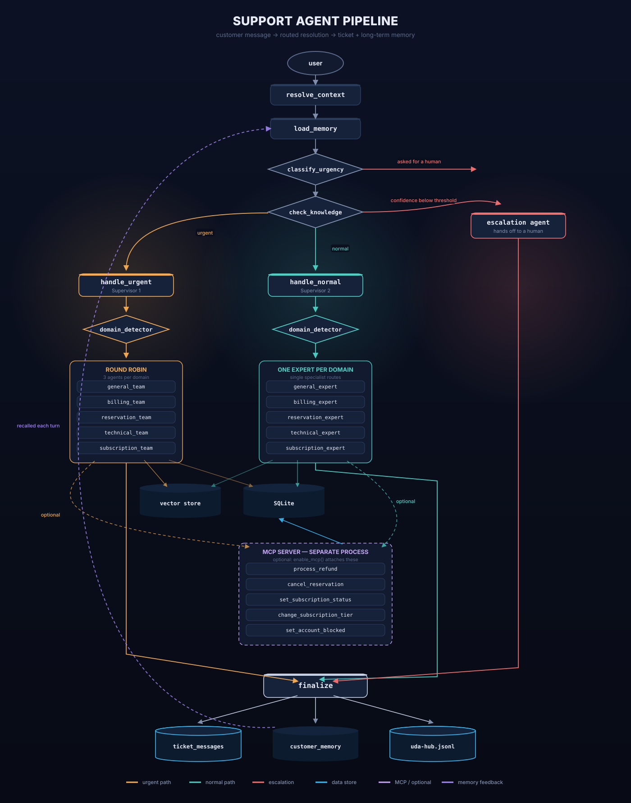
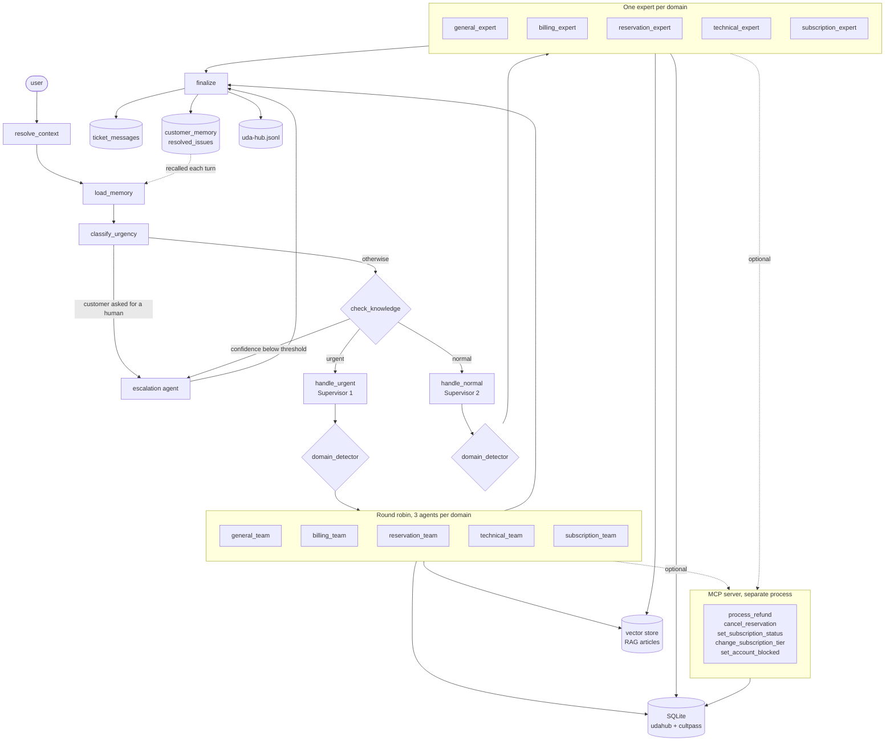

# UDA-Hub architecture

A ticket is classified by urgency, checked against what we actually know, then
routed. Urgent work goes to a team of interchangeable agents picked
round-robin, normal work to a single domain expert, and anything a person needs
to handle goes to the escalation agent.

The same graph as source, for editing:

## Inputs and outputs

One turn takes a customer message and produces an answer plus four durable
records. Everything the system needs beyond the message is resolved from the
ticket, so a bare chat client can send nothing but text and a `thread_id`.

### Inputs

| Input | Where it comes from | Required |
| --- | --- | --- |
| `query` | The customer's message, or the last message on the state | yes |
| `customer_id` | Passed in, or read off the ticket's `external_user_id` | no |
| `ticket_id` | Passed in, or the `thread_id` if it names a real ticket | no |
| `thread_id` | `config.configurable`; identifies the conversation | no |
| Ticket metadata | `udahub.tickets` — channel, tags, status, age | loaded |
| Long-term memory | `customer_memory`, `resolved_issues` | loaded |
| Knowledge articles | The FAISS vector store, retrieved by `check_knowledge` | loaded |
| Customer records | `cultpass.db`, read by the agents' tools | on demand |

`run_support_query(query, customer_id, ticket_id=None, thread_id=None)` is the
entry point; `chat()` wraps it in a console loop.

### Outputs

The call returns a dict:

| Field | Meaning |
| --- | --- |
| `response` | The reply to send the customer |
| `urgency` | `urgent`, `normal` or `escalation` |
| `domain` | Which specialism handled it, or `None` when escalated |
| `confidence` | The knowledge score, `None` when the check was skipped |
| `handled_by` | The exact agent name, e.g. `billing_agent_2` |
| `escalation_reason` | `customer_request`, `no_supporting_knowledge` or `None` |
| `tools_used` | Every tool the agent called, in order |
| `citations` | The article ids the answer rested on |
| `status` | `resolved`, `urgent_handled`, `escalated` or `pending` |

And `finalize` writes four things that outlive the call:

| Written to | What |
| --- | --- |
| `ticket_messages` | Both sides of the exchange, on the ticket |
| `resolved_issues` | A one-line record of how this turn ended |
| `checkpoints.db` | The thread's messages, so the next turn has them |
| `uda-hub.jsonl` | Every decision the turn made, as JSON lines |

`customer_memory` is written mid-turn instead, by the expert, whenever the
customer states a lasting preference.

## Agents and their roles

| Agent | Responsibility |
| --- | --- |
| `classify_urgency` | Decides urgent / normal / escalation from the message **and** the ticket's metadata. Does not answer anything. |
| `check_knowledge` | Scores whether the knowledge base or the customer's own records can support an answer at all. |
| `handle_urgent` (Supervisor 1) | Detects the domain and dispatches to that team's next agent. Delegates only. |
| `handle_normal` (Supervisor 2) | Detects the domain and hands off to that single expert. Delegates only. |
| Domain experts and team agents | Answer the question using the knowledge base and customer data tools. |
| `escalation_agent` | Marks the ticket escalated and tells the customer a person will follow up. |
| `finalize` | Records the outcome on the ticket, in long-term memory, and in the log. |

This is the **supervisor pattern**, twice: one supervisor for each priority
lane, each fronting a pool of specialists.

## Routing

`classify_urgency` applies its rules in order and stops at the first match, so
escalation outranks urgency. "This is broken, get me a manager" is an
escalation, because no automated answer will satisfy it.

It classifies on more than the message text. The ticket's `channel`, `tags`,
`status` and age are loaded by `resolve_context` and passed to the classifier,
so a ticket already tagged `login, access` on a chat channel reads as more
urgent than the same words typed cold.

Both supervisors then call `domain_detector` and dispatch. Neither answers a
ticket itself.

## Two ways into escalation

1. **The customer asked.** Detected at classification, and it skips the
   knowledge check — there is no point scoring articles for someone who has
   already said they want a person.
2. **We have nothing to answer with.** `check_knowledge` retrieves the top
   articles and scores coverage from 0 to 1. Below
   `KNOWLEDGE_CONFIDENCE_THRESHOLD` the ticket goes to a human rather than to
   an agent that would have to invent something.

The second check distinguishes *no article* from *no answer*. A question about
the customer's own bookings has no article behind it but is still answerable
from their records, so the scorer returns `answerable_by="customer_data"` and
the ticket proceeds. Only questions outside both fall through to a person.

## Grounding answers in the knowledge base

The confidence check decides *whether* to answer. Citations record *what the
answer was based on*.

`check_knowledge` already retrieves the top articles to score them, so those
articles — titles and ids — are put on the state and handed to whichever agent
takes the ticket. The agent does not have to search again for something we have
just looked up.

Experts are then required to end every reply with a `Sources:` line naming the
articles they used, or `Sources: customer records` when the answer came from
the customer's own data instead. `extract_citations` reads the article ids back
out of the reply, and `finalize` logs them on the `resolved` event.

It matches against the vector store's real article ids rather than against an
id-shaped pattern, which is what keeps a citation meaningful: an id the expert
invented matches nothing and is not recorded as a source. A logged citation is
therefore always an article that exists.

That makes grounding checkable rather than merely claimed: given a logged
answer, `read_log(ticket_id=...)` names the articles behind it, and each id can
be read and compared against what was said. An answer that cites nothing is
visible as exactly that.

## Round robin

Each domain has three interchangeable agents. `handle_urgent` reads the
rotation counter for that team, runs the team graph, and writes the next
position back. The counter lives in the orchestrator's state as `rr_index`
rather than inside the team graph, so it survives from one ticket to the next
instead of resetting to the first agent every time.

## Memory

Three levels, doing different jobs:

| Level | Where | Scope |
| --- | --- | --- |
| Short term | `SqliteSaver` checkpointer, keyed by `thread_id` | One conversation, across turns and across restarts |
| Conversation record | `ticket_messages` | One ticket, permanently |
| Long term | `customer_memory`, `resolved_issues` | One customer, across every session |

`load_memory` reads the long-term tables at the start of every turn and injects
both preferences and previously resolved issues into each agent's context.
Experts write preferences with `remember_customer_preference`; `finalize`
records how the ticket ended.

The checkpointer is on disk deliberately. `MemorySaver` would lose every thread
when the process exits, which makes "retrieve previous interactions for
returning customers" impossible to honour.

## Logging

Every decision is one JSON object per line in `data/logs/uda-hub.jsonl`:
`ticket_received`, `memory_recalled`, `classified`, `knowledge_checked`,
`routed`, `tool_used`, `resolved`, plus `mcp_tools_loaded` / `mcp_unavailable`
when the operation layer is switched on. Each carries `ticket_id` and
`customer_id`, so `read_log(ticket_id=...)` replays a whole ticket, and
`read_log(event="routed")` shows every routing decision the system has made.

The `resolved` event carries `citations`, so the log records not just what the
system answered but which articles the answer rested on.

Tool usage is logged from the agent's returned messages rather than from inside
each tool, which keeps the tools free of logging code while still capturing
every call.

## Tools

Experts get the knowledge base, customer and ticket lookups, and the memory
tools. They deliberately do **not** get `escalate_ticket` — only the escalation
agent can hand a ticket to a human, so an expert cannot escalate its way out of
a hard question.

## Support operations over MCP

The tools above are all reads. The operations that change a customer's account
live behind an MCP server in `agentic/mcp/server.py`, which runs as its own
process and speaks stdio:

| Operation | What it does |
| --- | --- |
| `process_refund` | Refunds a reservation and records the refund |
| `cancel_reservation` | Cancels a booking and releases the slot |
| `set_subscription_status` | Pauses, resumes or cancels a subscription |
| `change_subscription_tier` | Moves between basic and premium |
| `set_account_blocked` | Blocks or unblocks an account |

Two reasons for the split. First, a protocol boundary the agent cannot bypass:
reads happen in-process, writes only ever go through a request to another
process, which is where ownership and idempotence are enforced — every
operation checks that the customer owns what they are acting on, and refuses one
that has already happened. Second, portability: pointing the server at a real
CultPass backend later changes nothing in the agent code.

It is **opt-in**. `index.ipynb` and `index.py` run read-only; `enable_mcp()`
starts the server, rebuilds the experts and teams with its tools attached, and
updates the registries in place — the graph looks agents up by name at call
time, so the running graph picks them up without being recompiled. If the
server cannot start, `load_mcp_tools` logs `mcp_unavailable` and returns
nothing, so a broken MCP setup degrades the system to read-only rather than
breaking it.

`index_mcp.ipynb` is `index.ipynb` with that switch thrown.
